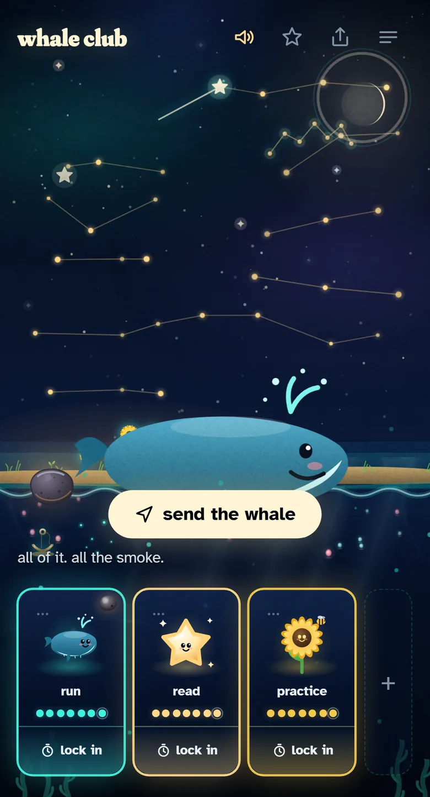
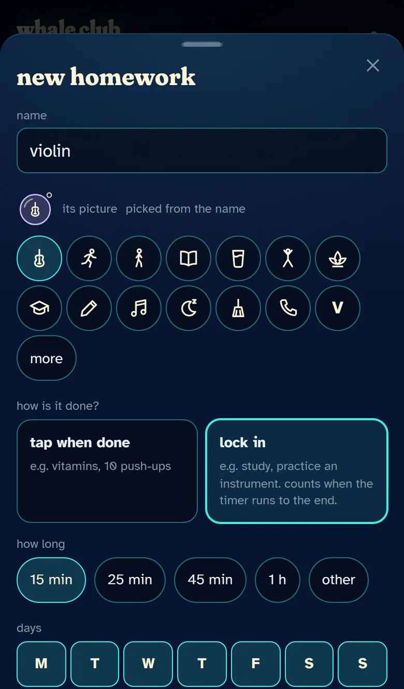
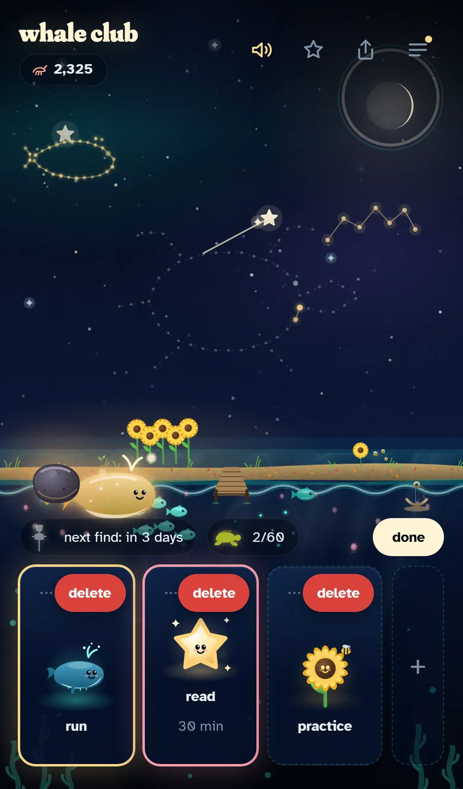
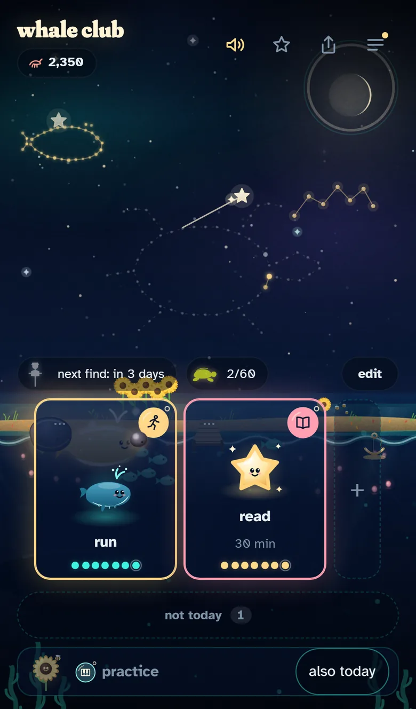
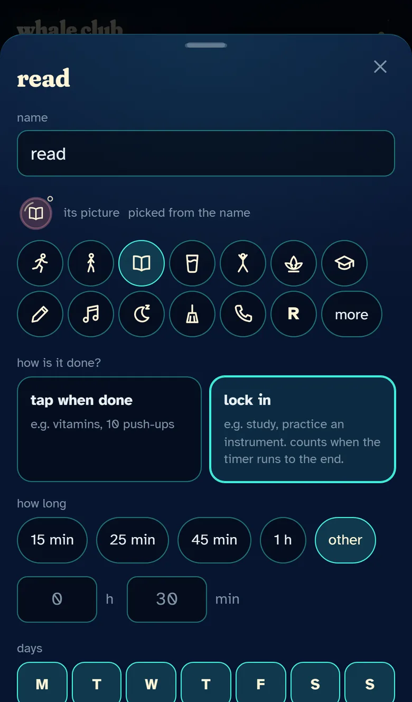
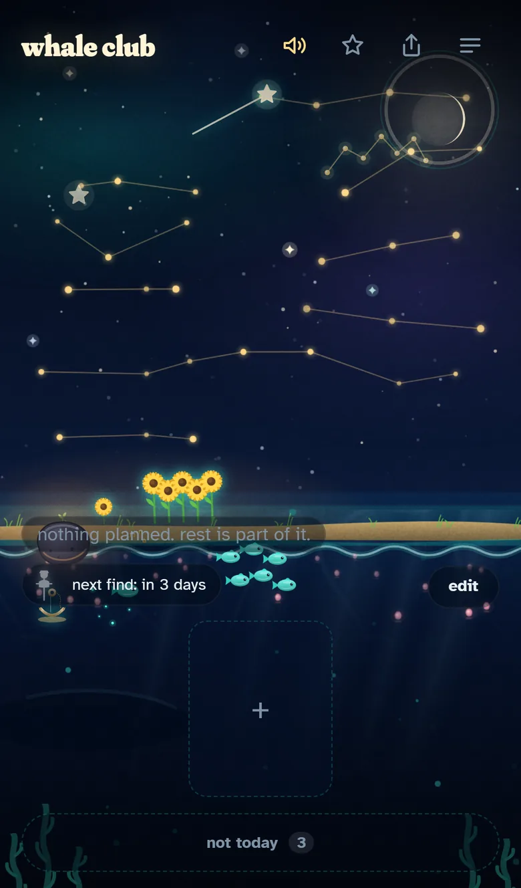
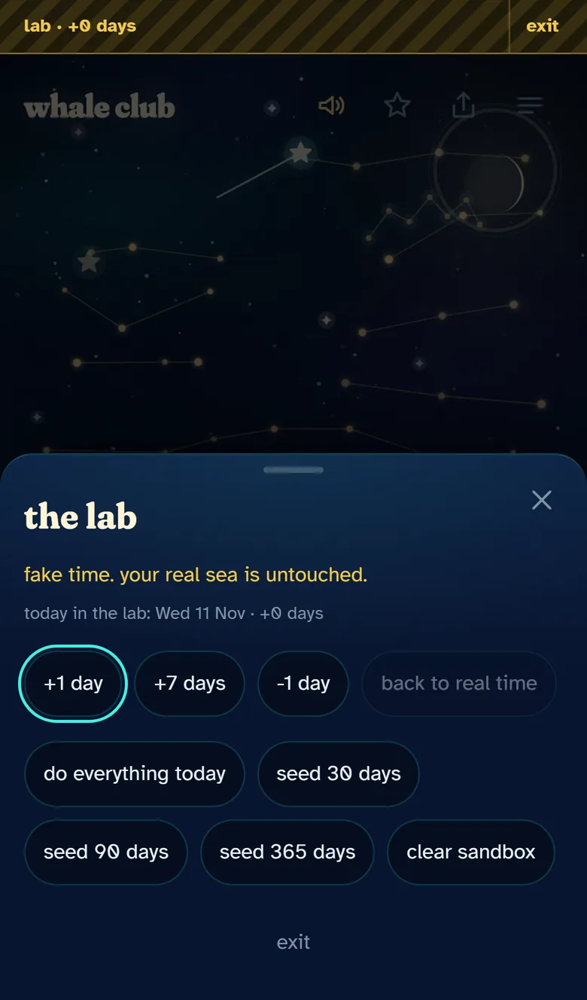

# Whale Club

A habit game where nothing dies.

> the app has to be a system-building start for people, the first easy step to go towards the life they desire, and this has to help them as much as it can. it's like being a beginner in the gym: you can start light, but you stay consistent and results show.
>
> (the author's principle for the app)

Pick a few simple things. Tap them when done, or lock in with a timer.
Every day you show up, the scene fills: a star in the sky, a creature that
grows, a collectible unlocked. Miss a day and the sea goes quiet for a day.
That is all that happens.

**Live:** https://dovjonikas.github.io/whale-club/

<p align="center">
  
  &nbsp;&nbsp;
  
  &nbsp;&nbsp;
  
</p>

<p align="center">
  
  &nbsp;
  
  &nbsp;
  
  &nbsp;
  
  &nbsp;
  
  &nbsp;
  
</p>

<p align="center">
  
  &nbsp;
  
  &nbsp;
  
  &nbsp;
  
  &nbsp;
  
  &nbsp;
  
  &nbsp;
  
  &nbsp;
  
</p>

<p align="center">
  
  &nbsp;&nbsp;
  
</p>

## The rules

1. the first rule of whale club is: you show up.
2. the second rule of whale club is: you show up tomorrow.
3. the third rule of whale club is: you never give up on yourself.

And underneath all three: nothing dies. You just missed a day.

## Features

- **One screen.** Night sky above, sea below, a shore with a garden at the
  horizon. The row of your things at the bottom. Nothing else.
- **Up to five things**, each assigned a world in turn: sea, sky, garden,
  sea, sky. You do not pick; every scene gets all three layers.
- **Two kinds of thing.** "Tap when done" is a list: tap the card, done;
  tap again, not done. "Lock in" counts only when its timer has seen the
  whole length that day (fifteen minutes to start: start light). Only the
  minutes the timer saw count, and parts of a day add up: a phone that
  died, a call, a closed app lose nothing, and the card offers "12/25 ·
  finish". Did it without the phone? Its sheet has "did it without the
  timer", twice a week, honestly asked.
- **Tap = done today.** The creature jumps, the world answers (bubbles,
  star dust, petals), one short line. Tap again to undo.
- **Every change has a word.** "edit" over the row puts a red "delete" on
  every card and makes a tap open the card's sheet. Delete never asks "are
  you sure": the card swims off and "undo" waits ten seconds; the stars and
  finds it earned stay.
- **The first minute.** A first open shows a year in silhouette (a day
  counter running to 365, the sky filling, creatures growing, stones
  opening, the whale rising before the moon), then the author's sentence
  played like a song that climbs: the eyes open on the empty sea of day
  one, blink at the turn, the stars double as "compound" is read, and the
  first star blooms on the last word. A small score plays under it, a note
  for every word, all synthesised. Then one button: "start light". Skip is
  always there.
  After that, every mechanic explains itself in one line the first time it
  shows, and the next find is always in sight above the row.
- **Days, if you want them.** Every thing is planned every day unless
  you say otherwise: its sheet has one line of seven day chips. The first
  screen shows only today's things; the rest wait in a thin "not today"
  strip, and any of them can be added for today only. A day off is never a
  missed day: the dots show it as a dash, the streak walks past it, and a
  thing done three times a week still grows into a whale.
- **Lock in.** Tap a lock-in card, turn the dial (10 to 120 minutes),
  and the world sinks into deep water: only the creature, a slow ring and
  the name, the time hidden until a tap. Undo in the first ten seconds, one
  pause of five minutes. Leave for more than fifteen seconds and the count
  stops until you come back. The end opens the world again in order, and
  leaves a lantern in the cove.
  total, so they can shrink and grow back. Nothing is ever lost.
- **Stars are days.** Every day with at least one thing done puts a star
  in the sky, laid out week by week. A streak draws a constellation. After
  a few months the sky is the progress report, no graph needed.
- **A missed day** dims the scene for a day and says so. That is the whole
  punishment.
- **Installable.** Works offline from the home screen on iPhone and
  Android, updates itself, no account, no server, no tracking. Everything
  stays in your browser.
- **Stones.** What you earn falls in as a meteor stone: floating in the
  sea, hanging in the sky, lying on the shore. It waits for you. Three taps
  crack it, and the find comes out of the light and takes its place:
  plankton glow, a fish, a jellyfish at night, the red jacket, the whale's
  song; a comet, the aurora, an astronaut; a sunflower field, a scarecrow,
  fireflies. Sixty in all, at 3, 7, 14, 21, 30, 45, 60, 90, 120 and 180
  days. Some come out rare, a few legendary; that is only the shine.
- **All done, the whale surfaces.** Over the horizon, with a sound. From
  day 90 it wears the red jacket.
- **A daily surprise** after the first thing done: a sea fact, a visitor
  crossing the scene, a glow. Never the same one until the pool is spent.
- **A check-in** once a day. Two taps. It is silly on purpose.
- **A weekly recap**: "5/7." and one line. Never what was missed.
- **Sound** behind a tap gate, one button to mute. **Share** the scene as a
  picture with "day N of whale club" on it.
- **Postcards.** When the whale surfaces, a collectible unlocks or a
  creature grows, one button appears: send the whale. It paints the scene
  as a picture (a story or a square) with the day and the moment's line,
  and opens the share sheet. The club is you and whoever you send your
  whale to. No accounts, no codes: the picture is the only thing that
  leaves the phone.

## The look

Every thing wears a bubble: a glass float in its colour, its picture
drawn in one cream line, a light arc where the glass catches the moon,
and one tiny bubble rising off the rim, the signature. Done, the bubble
fills with its colour and the small bubble pops into three; a lock-in's
rim is its timer. The pictures are the app's own, 48 of them on a 24 grid,
picked from a thing's name in English or Lithuanian ("violin",
"smuikas", "run", "bėgimas"), or its first letter when nothing fits. The
interface's icons and the app icon, a whale's tail in a bubble, are drawn
in the same hand. All of it on one page, drawn by the app's own code:
[the icon set](https://dovjonikas.github.io/whale-club/brand.html). The
plan and its critique are in [docs/brand/BRAND.md](docs/brand/BRAND.md).

## Tech

Vite, TypeScript (strict, no `any`), vanilla DOM, SVG creatures, two small
canvases (stars, particles) animated with transforms and opacity only.
localStorage for data. `vite-plugin-pwa` for the manifest and the
service worker. Playwright for tests on three device profiles. GitHub
Actions to GitHub Pages.

## Lighthouse

Measured on the live URL (v0.8.0) with Lighthouse 12.8 through Microsoft
Edge, 2026-10-07, the median of three runs:

|         | Performance | Accessibility | Best practices | SEO |
| ------- | ----------- | ------------- | -------------- | --- |
| Mobile  | 98          | 100           | 100            | 100 |
| Desktop | 100         | 100           | 100            | 100 |

Lighthouse 12 no longer has a PWA category. Installability is held by the
tests instead: the manifest, the service worker, an offline reload and an
update under an open page.

## Run

```bash
npm install
npm run dev
```

Then open the URL Vite prints. `npm run build` builds into `dist/`,
`npm run preview` serves the build the way Pages does.

## Test

```bash
npx playwright install chromium
npm test
```

Runs every test on an iPhone 13, a Pixel 5 and a 1366x768 desktop against
the production build. `npm run lint` runs ESLint and Prettier.

A hidden lab with a movable clock, see docs: [the lab](docs/ARCHITECTURE.md#10-the-lab).

<p align="center">
  
</p>

## Deploy

Push to `main`. The workflow in `.github/workflows/deploy.yml` lints,
builds, runs the tests, and publishes `dist/` to GitHub Pages. Pull
requests get the build and the tests but never deploy.

## Docs

- [docs/DESIGN.md](docs/DESIGN.md): colours, type, layout, the signature moment.
- [docs/brand/BRAND.md](docs/brand/BRAND.md): the bubble, the glyphs, the app icon; [the icon set](https://dovjonikas.github.io/whale-club/brand.html) shows them all.
- [docs/QUALITY.md](docs/QUALITY.md): the motion and interface audits, with what changed.
- [docs/COLLECTIBLES.md](docs/COLLECTIBLES.md): every collectible, by world, line and day.
- [docs/ARCHITECTURE.md](docs/ARCHITECTURE.md): how it is put together and how to add to it.
- [docs/DECISIONS.md](docs/DECISIONS.md): what was decided and why.
- [docs/STATE.md](docs/STATE.md): where the project is.
- [docs/RESEARCH-SEA.md](docs/RESEARCH-SEA.md) and [docs/RESEARCH-DOPAMINE.md](docs/RESEARCH-DOPAMINE.md): the research behind the daily surprise and the reward design.

## License

MIT. See [LICENSE](LICENSE).

Built with Claude Code; the idea, the rules, the design direction, the
testing and the decisions are the author's.
