# Whale Club

A habit game where nothing dies.

Pick a few simple things. Tap them when done, or run a timer. Every day you
show up, the scene fills: a star in the sky, a creature that grows, a
collectible unlocked. Miss a day and the sea goes quiet for a day. That is
all that happens.

**Live:** https://dovjonikas.github.io/whale-club/

<p align="center">
  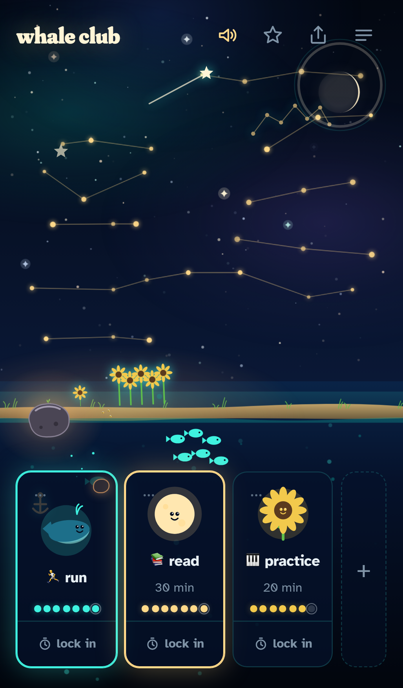
  &nbsp;&nbsp;
  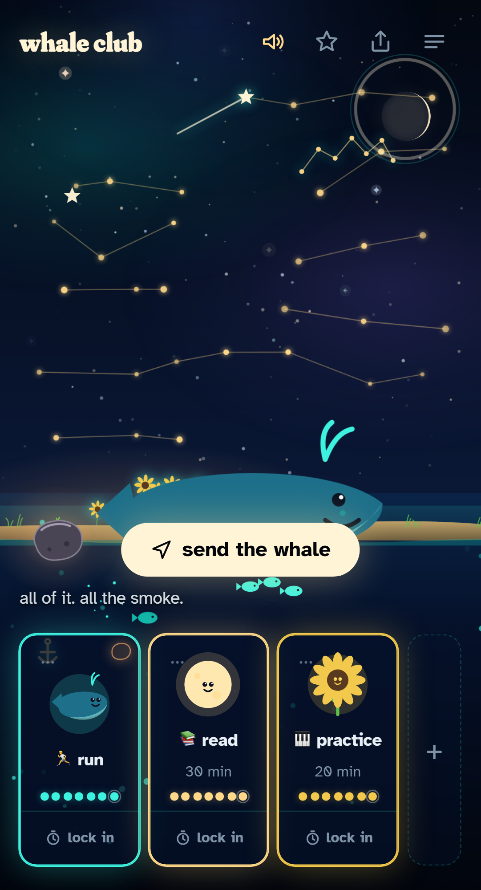
  &nbsp;&nbsp;
  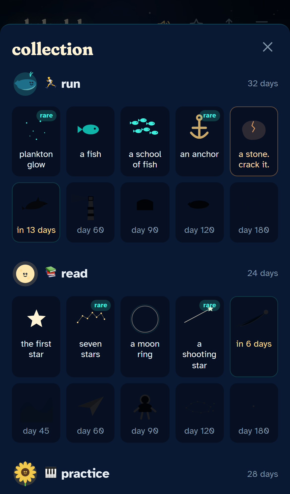
</p>

<p align="center">
  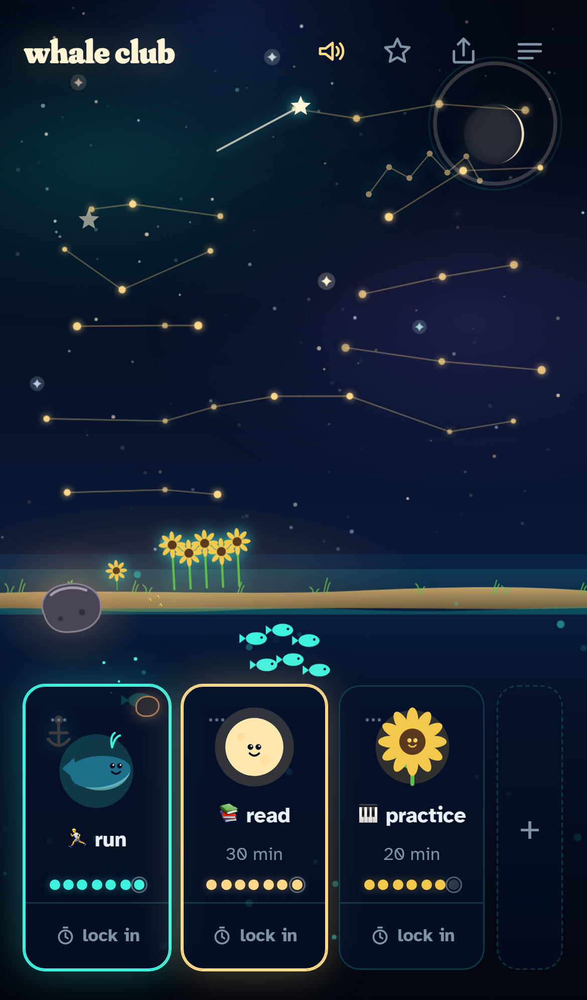
  &nbsp;
  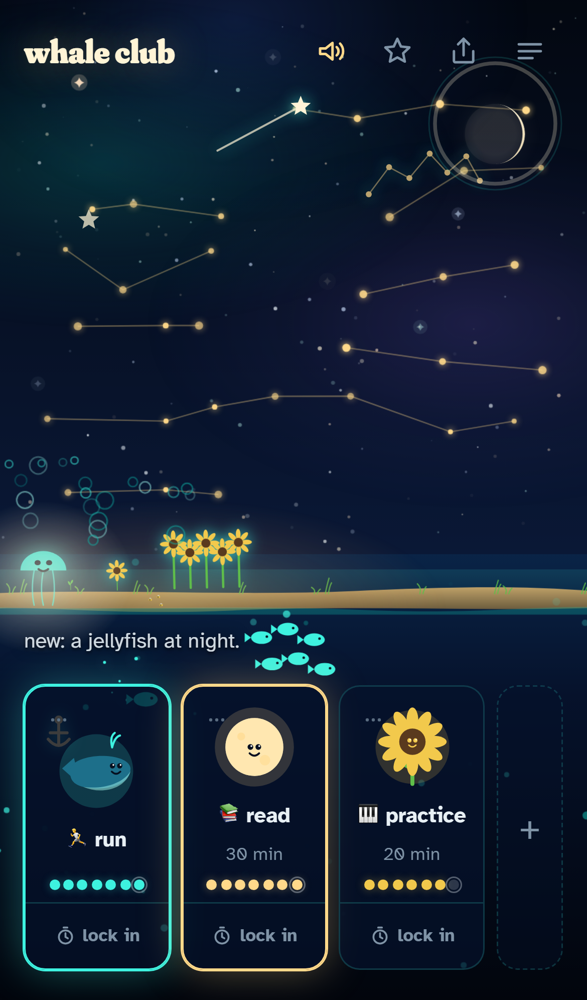
  &nbsp;
  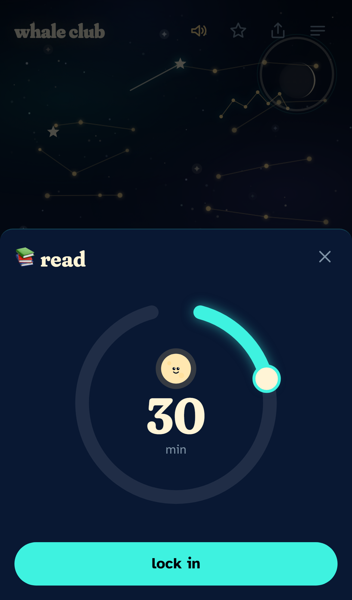
  &nbsp;
  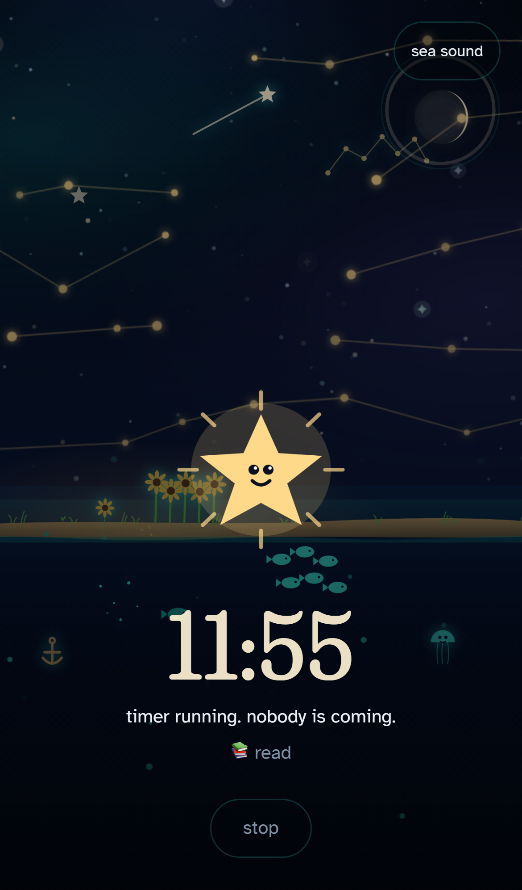
</p>

<p align="center">
  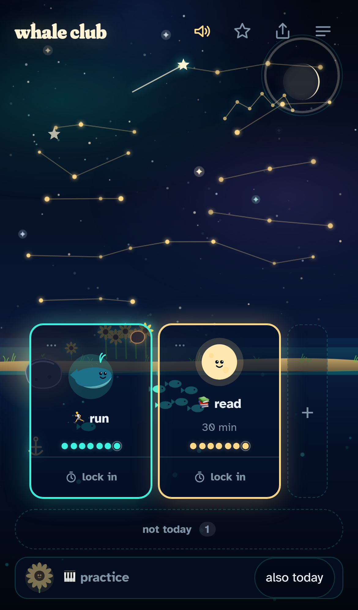
  &nbsp;
  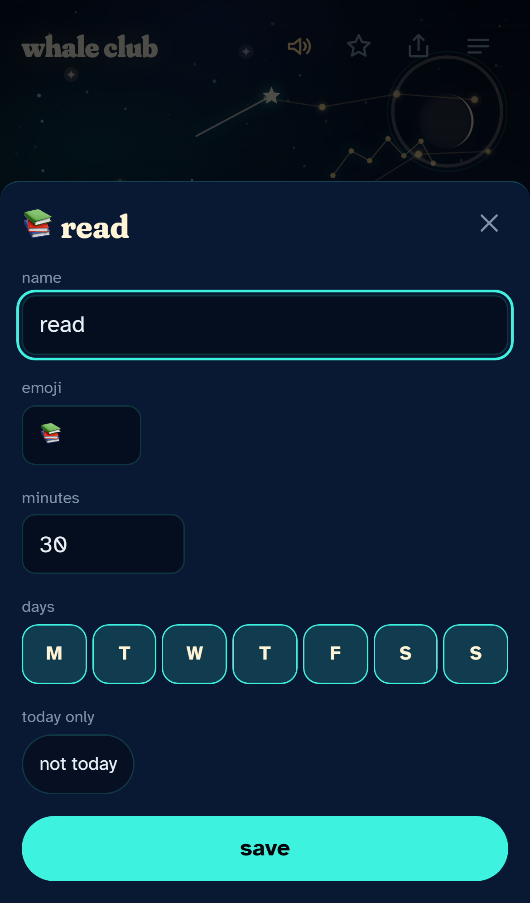
  &nbsp;
  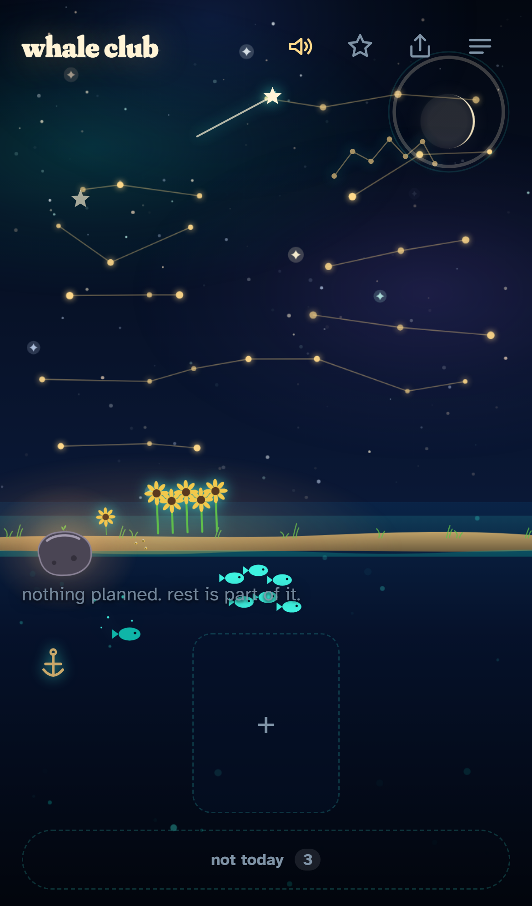
</p>

<p align="center">
  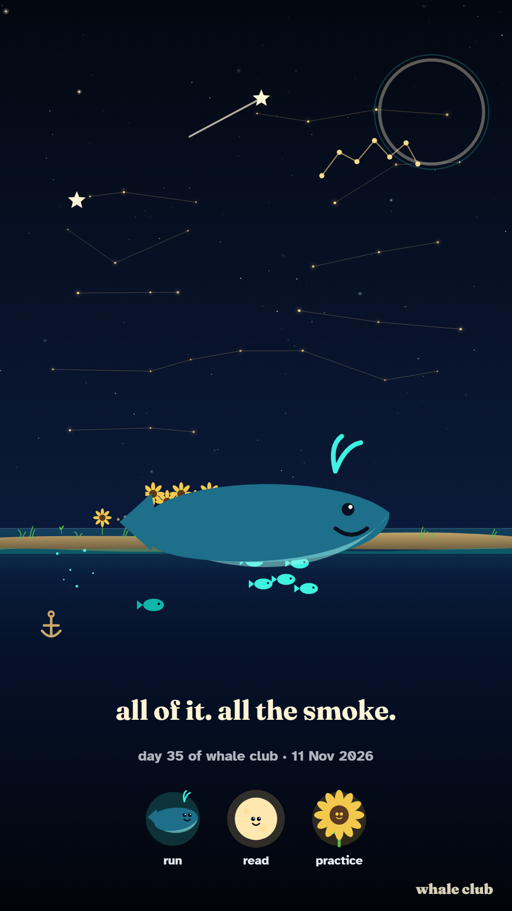
  &nbsp;&nbsp;
  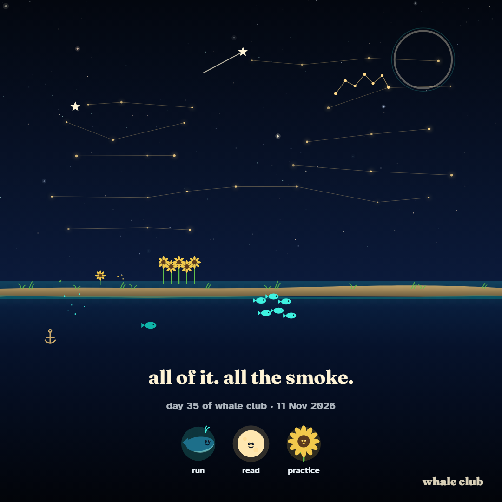
</p>

## The rules

1. the first rule of whale club is: you show up.
2. the second rule of whale club is: you show up tomorrow.
3. the third rule of whale club is: you never give up on yourself.

And underneath all three: nothing dies. You just missed a day.

## Features

- **One screen.** Night sky above, sea below, a shore with a garden at the
  horizon. The row of your things at the bottom. Nothing else.
- **Up to five things**, each assigned a world in turn: sea, sky, garden,
  sea, sky. You do not pick; every scene gets all three layers.
- **Tap = done today.** The creature jumps, the world answers (bubbles,
  star dust, petals), one short line. Tap again to undo.
- **Days, if you want them.** Every thing is planned every day unless
  you say otherwise: its sheet has one line of seven day chips. The first
  screen shows only today's things; the rest wait in a thin "not today"
  strip, and any of them can be added for today only. A day off is never a
  missed day: the dots show it as a dash, the streak walks past it, and a
  thing done three times a week still grows into a whale.
- **Lock in.** Under every card. Turn the dial (10 to 120 minutes), and
  the screen goes quiet: the sky turns, the time counts down, and the
  thing's creature starts as an egg, a spark or a seed and grows while you
  stay. Leave for more than fifteen seconds and it does not die: it waits
  for you. It just stays small that time.
  total, so they can shrink and grow back. Nothing is ever lost.
- **Stars are days.** Every day with at least one thing done puts a star
  in the sky, laid out week by week. A streak draws a constellation. After
  a few months the sky is the progress report, no graph needed.
- **A missed day** dims the scene for a day and says so. That is the whole
  punishment.
- **Installable.** Works offline from the home screen on iPhone and
  Android, updates itself, no account, no server, no tracking. Everything
  stays in your browser.
- **Stones.** What you earn falls in as a meteor stone: floating in the
  sea, hanging in the sky, lying on the shore. It waits for you. Three taps
  crack it, and the find comes out of the light and takes its place:
  plankton glow, a fish, a jellyfish at night, the red jacket, the whale's
  song; a comet, the aurora, an astronaut; a sunflower field, a scarecrow,
  fireflies. Sixty in all, at 3, 7, 14, 21, 30, 45, 60, 90, 120 and 180
  days. Some come out rare, a few legendary; that is only the shine.
- **All done, the whale surfaces.** Over the horizon, with a sound. From
  day 90 it wears the red jacket.
- **A daily surprise** after the first thing done: a sea fact, a visitor
  crossing the scene, a glow. Never the same one until the pool is spent.
- **A check-in** once a day. Two taps. It is silly on purpose.
- **A weekly recap**: "5/7." and one line. Never what was missed.
- **Sound** behind a tap gate, one button to mute. **Share** the scene as a
  picture with "day N of whale club" on it.
- **Postcards.** When the whale surfaces, a collectible unlocks or a
  creature grows, one button appears: send the whale. It paints the scene
  as a picture (a story or a square) with the day and the moment's line,
  and opens the share sheet. The club is you and whoever you send your
  whale to. No accounts, no codes: the picture is the only thing that
  leaves the phone.

## Why not Forest

Forest is lovely and it got a lot of people to put their phones down. Whale
Club starts from a different idea of what helps someone keep going: one
living scene instead of a field of trees; the things done without a clock
and the sessions in one place; no coins, no shop, no subscription, no ads,
no account; offline from the home screen; collectibles instead of currency
and postcards instead of a leaderboard. And nothing dies. A session you
leave waits for you; a day you miss dims the sea for a day.

One honest note: a phone does not let a web app play sound or show a
notification in the background. If the session ends while the app is
hidden, the end is worked out from the clock and shown when you come back.
Lay the phone next to you with the screen on, the way Forest asks; Whale
Club keeps the screen awake while a session runs.

## Tech

Vite, TypeScript (strict, no `any`), vanilla DOM, SVG creatures, two small
canvases (stars, particles) animated with transforms and opacity only.
localStorage for data. `vite-plugin-pwa` for the manifest and the
service worker. Playwright for tests on three device profiles. GitHub
Actions to GitHub Pages.

## Lighthouse

Measured on the live URL with Lighthouse 12 through Microsoft Edge,
2026-10-07, before the accessibility fix in 0.4.0:

|         | Performance | Accessibility | Best practices | SEO |
| ------- | ----------- | ------------- | -------------- | --- |
| Mobile  | 99          | 93            | 100            | 100 |
| Desktop | 100         | 93            | 100            | 100 |

Lighthouse 12 no longer has a PWA category. Installability is held by the
tests instead: the manifest, the service worker, an offline reload and an
update under an open page.

## Run

```bash
npm install
npm run dev
```

Then open the URL Vite prints. `npm run build` builds into `dist/`,
`npm run preview` serves the build the way Pages does.

## Test

```bash
npx playwright install chromium
npm test
```

Runs every test on an iPhone 13, a Pixel 5 and a 1366x768 desktop against
the production build. `npm run lint` runs ESLint and Prettier.

## Deploy

Push to `main`. The workflow in `.github/workflows/deploy.yml` lints,
builds, runs the tests, and publishes `dist/` to GitHub Pages. Pull
requests get the build and the tests but never deploy.

## Docs

- [docs/DESIGN.md](docs/DESIGN.md): colours, type, layout, the signature moment.
- [docs/COLLECTIBLES.md](docs/COLLECTIBLES.md): every collectible, by world, line and day.
- [docs/ARCHITECTURE.md](docs/ARCHITECTURE.md): how it is put together and how to add to it.
- [docs/DECISIONS.md](docs/DECISIONS.md): what was decided and why.
- [docs/STATE.md](docs/STATE.md): where the project is.
- [docs/RESEARCH-SEA.md](docs/RESEARCH-SEA.md) and [docs/RESEARCH-DOPAMINE.md](docs/RESEARCH-DOPAMINE.md): the research behind the daily surprise and the reward design.

## License

MIT. See [LICENSE](LICENSE).

Built with Claude Code; the idea, the rules, the design direction, the
testing and the decisions are the author's.
