<p align="center">
  <a href="https://dovjonikas.github.io/whale-club/">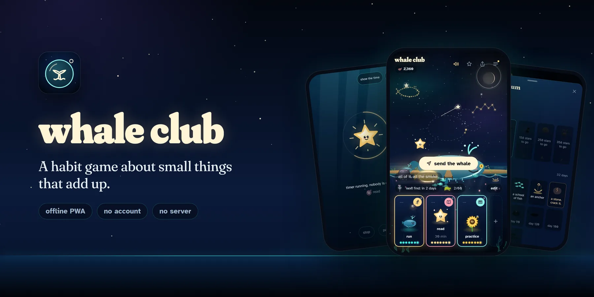</a>
</p>

<p align="center"><strong>Pick a few small things. Do them. Watch a night sea fill up.</strong></p>

<p align="center">
  <a href="https://dovjonikas.github.io/whale-club/"><strong>Open the app</strong></a>
  &nbsp;·&nbsp;
  <a href="#how-it-plays">How it plays</a>
  &nbsp;·&nbsp;
  <a href="https://dovjonikas.github.io/whale-club/brand.html">The look</a>
  &nbsp;·&nbsp;
  <a href="docs/ARCHITECTURE.md">How it is built</a>
  &nbsp;·&nbsp;
  <a href="docs/STATE.md">Where it stands</a>
</p>

<p align="center">
  <a href="https://github.com/dovjonikas/whale-club/actions/workflows/deploy.yml"></a>
  <a href="LICENSE"></a>
  
  
  
  
  
  
</p>

Whale Club is a habit tracker built as a small, quiet game. You choose up to
five simple things. Each day you tap them when they are done, or lock in with
a timer. Every day you show up, a night scene answers: a star in the sky, a
creature that grows, a find in the sea, the sky or the garden. Miss a day and
the sea goes quiet for a day. That is all that happens.

It installs from the browser on a phone, works offline, and keeps everything
on the device. There is no account, no server and no tracking.

## Why it exists

> the app has to be a system-building start for people, the first easy step to go towards the life they desire, and this has to help them as much as it can. it's like being a beginner in the gym: you can start light, but you stay consistent and results show.
>
> (the author's principle for the app)

Most habit apps run on loss: a streak that breaks, a red day, a pet that
dies. That works until the first bad week, and then it is the reason to
stop. Whale Club is built the other way round. Nothing is ever taken away,
a missed day is never counted against you, and what you earned stays in the
scene. The pull is toward the next small thing, never away from a failure.

It is also a public portfolio piece, so it is built the way a professional
codebase is: typed strictly, tested on three devices against the production
build, measured before it ships, with every harder call written down with
what it costs ([`docs/DECISIONS.md`](docs/DECISIONS.md)).

## How it plays

<table>
  <tr>
    <td align="center" valign="top" width="33%">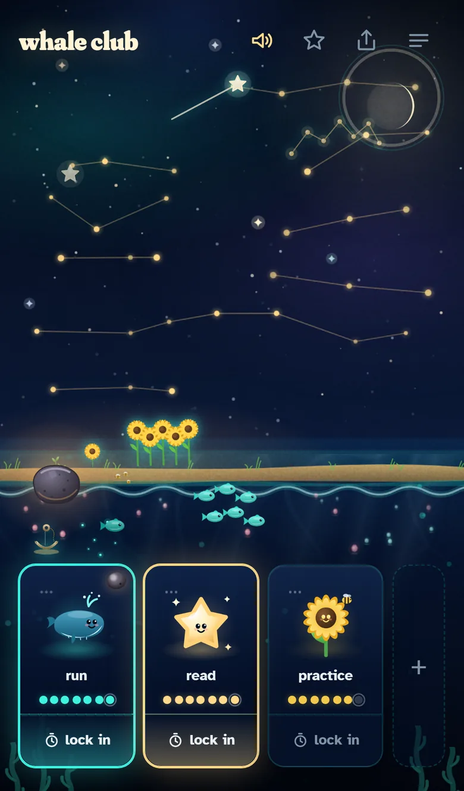<br><b>The sea</b><br><sub>Every day you show up is a star. A streak draws a constellation.</sub></td>
    <td align="center" valign="top" width="33%">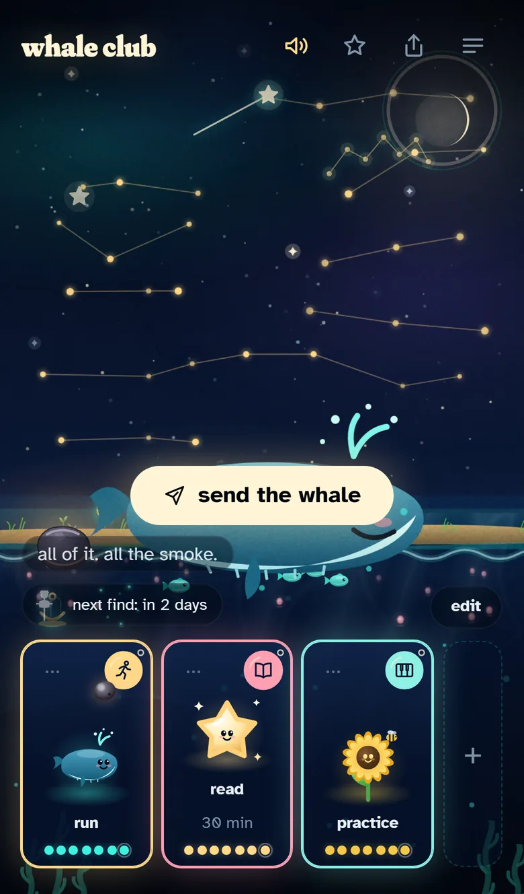<br><b>All done</b><br><sub>The whale surfaces, with one line and one button to send it.</sub></td>
    <td align="center" valign="top" width="33%">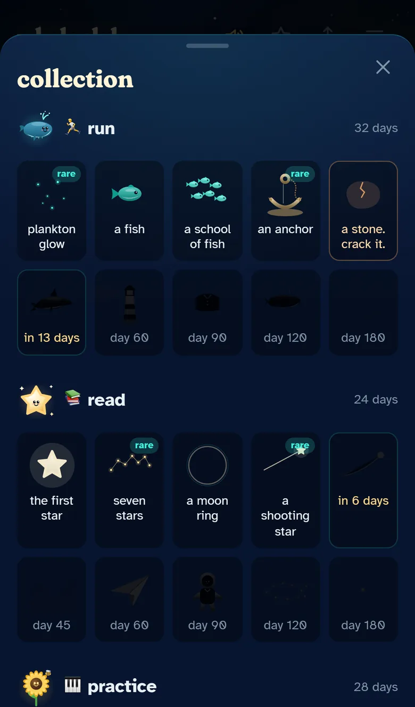<br><b>The collection</b><br><sub>Sixty finds at 3 to 180 days. The next one is always in sight.</sub></td>
  </tr>
  <tr>
    <td align="center" valign="top">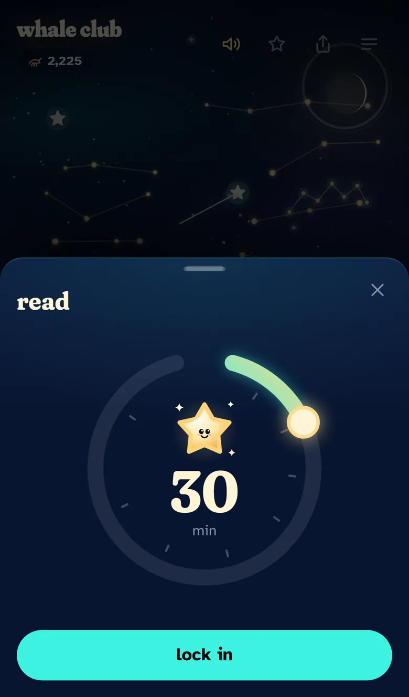<br><b>Lock in</b><br><sub>Turn the dial, from 10 to 120 minutes.</sub></td>
    <td align="center" valign="top">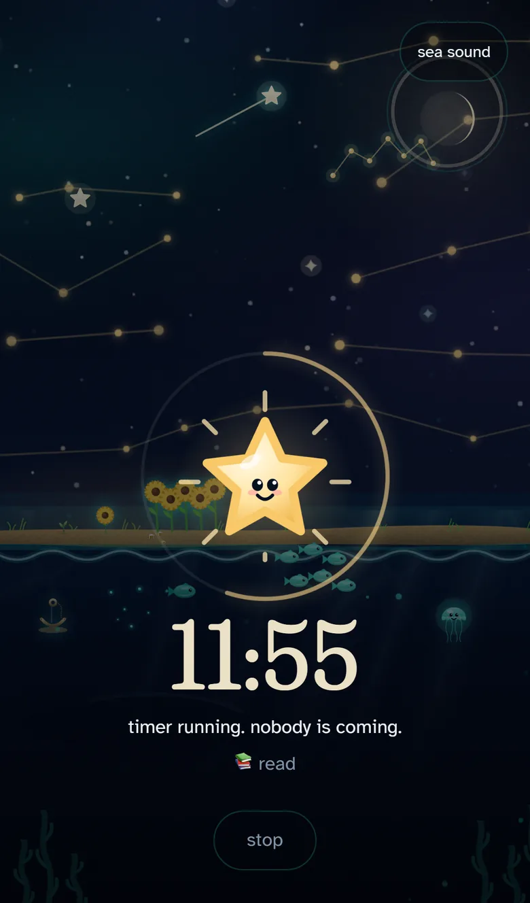<br><b>Deep water</b><br><sub>Only the creature and a slow ring. The time hides until you tap.</sub></td>
    <td align="center" valign="top">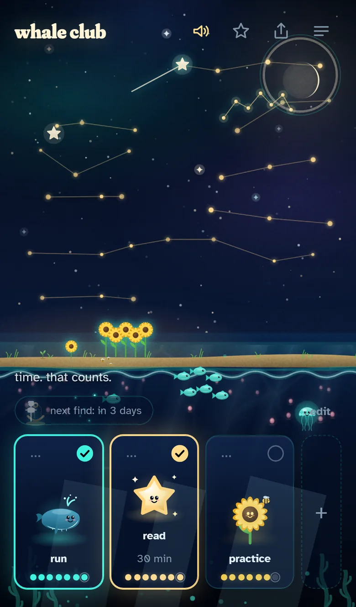<br><b>Coming back up</b><br><sub>The world returns in order and leaves a lantern in the cove.</sub></td>
  </tr>
  <tr>
    <td align="center" valign="top">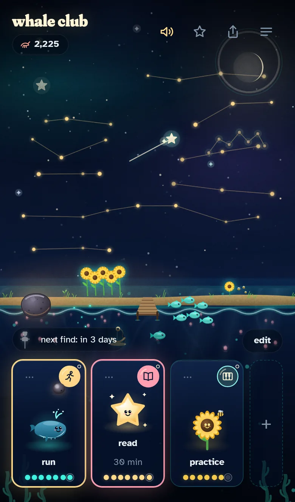<br><b>A stone</b><br><sub>What you earn falls in as a stone and waits for you.</sub></td>
    <td align="center" valign="top">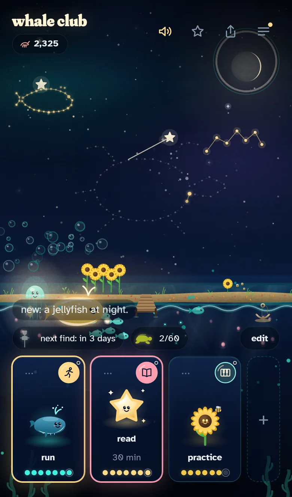<br><b>A find</b><br><sub>Three taps crack it. Some come out rare.</sub></td>
    <td align="center" valign="top">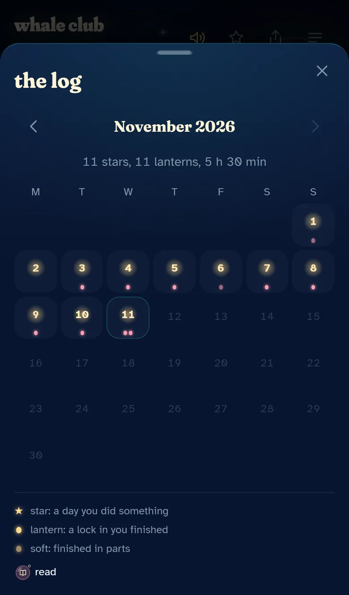<br><b>The log</b><br><sub>A month in one sentence. Never what was missed.</sub></td>
  </tr>
  <tr>
    <td align="center" valign="top">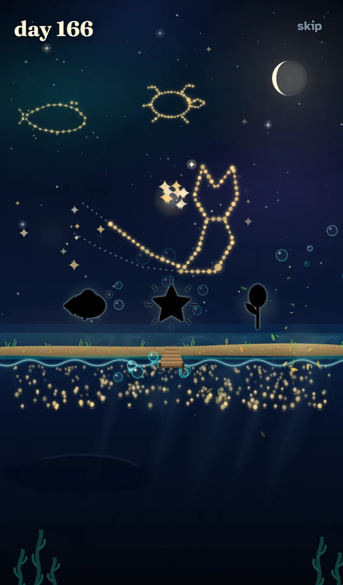<br><b>The first minute</b><br><sub>A year in silhouette, the counter running to 365.</sub></td>
    <td align="center" valign="top">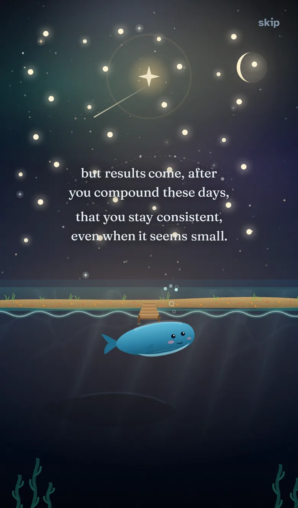<br><b>The promise</b><br><sub>The idea in one sentence, a synthesised note for every word.</sub></td>
    <td align="center" valign="top">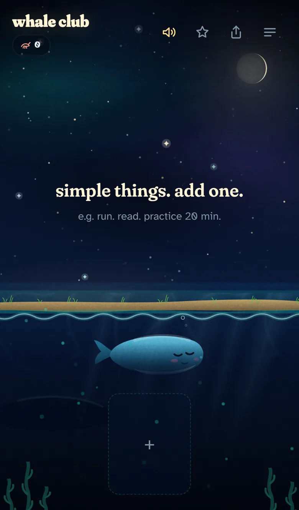<br><b>Day one</b><br><sub>One empty card, and a small whale asleep under the surface.</sub></td>
  </tr>
</table>

<p align="center">
  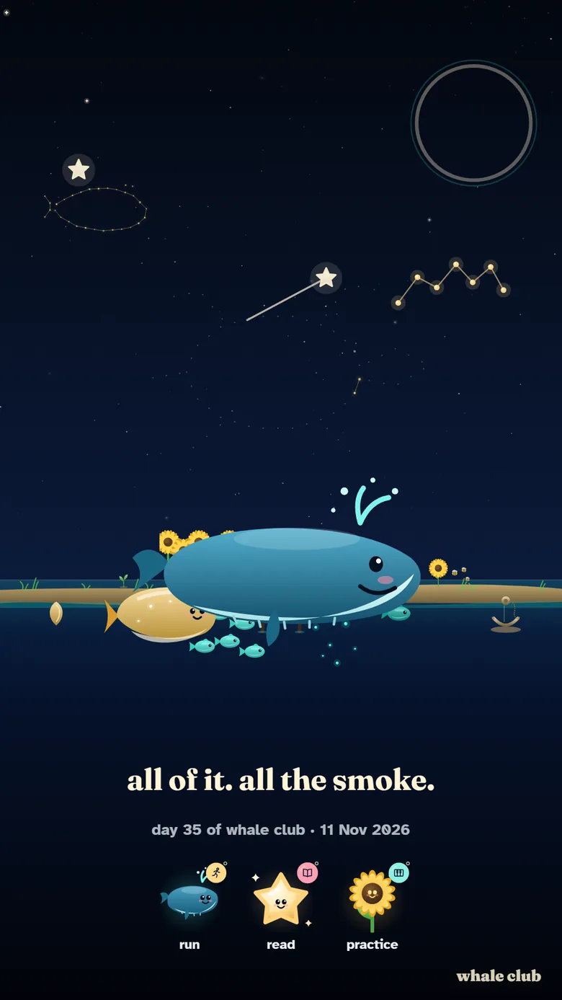
  &nbsp;&nbsp;
  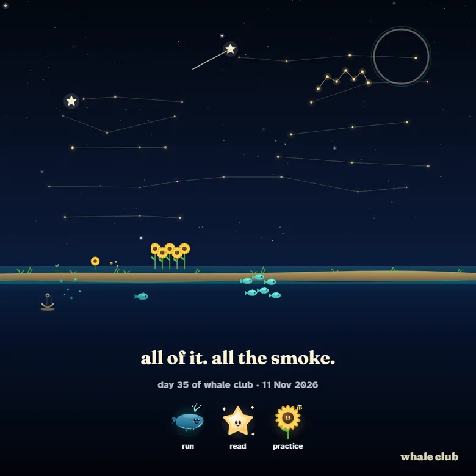
  <br>
  <sub><b>Postcards.</b> The scene painted as a picture, story or square, with the day and the moment's line. The only thing that ever leaves the phone, and only when you send it.</sub>
</p>

<p align="center"><sub>Every picture here is made by <code>npm run shots</code> from a seeded history under a pinned clock. Running it twice gives the same files.</sub></p>

## The rules

1. the first rule of whale club is: you show up.
2. the second rule of whale club is: you show up tomorrow.
3. the third rule of whale club is: you never give up on yourself.

And underneath all three: nothing dies. You just missed a day.

## What it does

- **One screen.** A night sky above, a sea below, a shore with a garden at the horizon, and the row of your things at the bottom
- **Two kinds of thing.** "Tap when done" is a checkbox with a creature on it. "Lock in" counts only the minutes its timer saw, and the parts of a day add up: a call, a dead battery or a closed app lose nothing
- **Days, if you want them.** Every thing is planned every day unless you say otherwise. A day off is never a missed day: the streak walks past it, and a thing done three times a week still grows
- **Stars are days.** After a few months the sky is the progress report, with no graph needed
- **Stones and finds.** Sixty finds across three worlds, earned at 3, 7, 14, 21, 30, 45, 60, 90, 120 and 180 days. Some come out rare and a few legendary; that is only the shine
- **A missed day** dims the scene for a day and says so. That is the whole punishment
- **The first minute** shows a year in silhouette, then plays the idea as a short piece of music, then asks for one thing. Skip is always there
- **Postcards** of the whale, a new find or a grown creature, ready for the share sheet

<details>
<summary><strong>The longer list</strong></summary>

- Up to five things, each given a world in turn (sea, sky, garden), so every scene gets all three layers
- Tap again to undo. Delete never asks "are you sure": the card swims off and undo waits ten seconds, and the stars and finds it earned stay
- A lock-in has undo in its first ten seconds and one pause of five minutes. Leave the app for more than fifteen seconds and the count stops until you come back; it waits, it never fails
- "Did it without the timer" is there twice a week, and asks honestly
- The first time each mechanic appears it explains itself in one line, once
- A daily surprise after the first thing done: a sea fact, a visitor crossing the scene, a glow. Never the same one until the pool is spent
- A check-in once a day, two taps, silly on purpose
- A weekly recap: "5/7." and one line. Never what was missed
- The whale surfaces when everything is done; from day 90 it wears the red jacket
- Sound behind a tap gate, synthesised in the browser with no audio files, and one button to mute it
- Every line the app says lives in one file, [`src/voice.ts`](src/voice.ts)
- Installs on iPhone and Android, works offline, and the next open after a deploy is the new version

</details>

## The look

Every thing wears a bubble: a glass float in its own colour with its
picture drawn in one cream line, a light arc where the glass catches the
moon, and one tiny bubble rising off the rim. Done, the bubble fills and the
small bubble pops; a lock-in's rim is its timer. The 48 pictures are the
app's own, drawn on a 24 grid and picked from a thing's name in English or
Lithuanian ("violin", "smuikas", "run", "bėgimas"), or its first letter when
nothing fits. The interface icons and the app icon are drawn in the same
hand.

All of it is on one page, rendered by the app's own code so it cannot drift
from the app: **[the icon set](https://dovjonikas.github.io/whale-club/brand.html)**.
The plan and its critique are in [`docs/brand/BRAND.md`](docs/brand/BRAND.md).

<p align="center">
  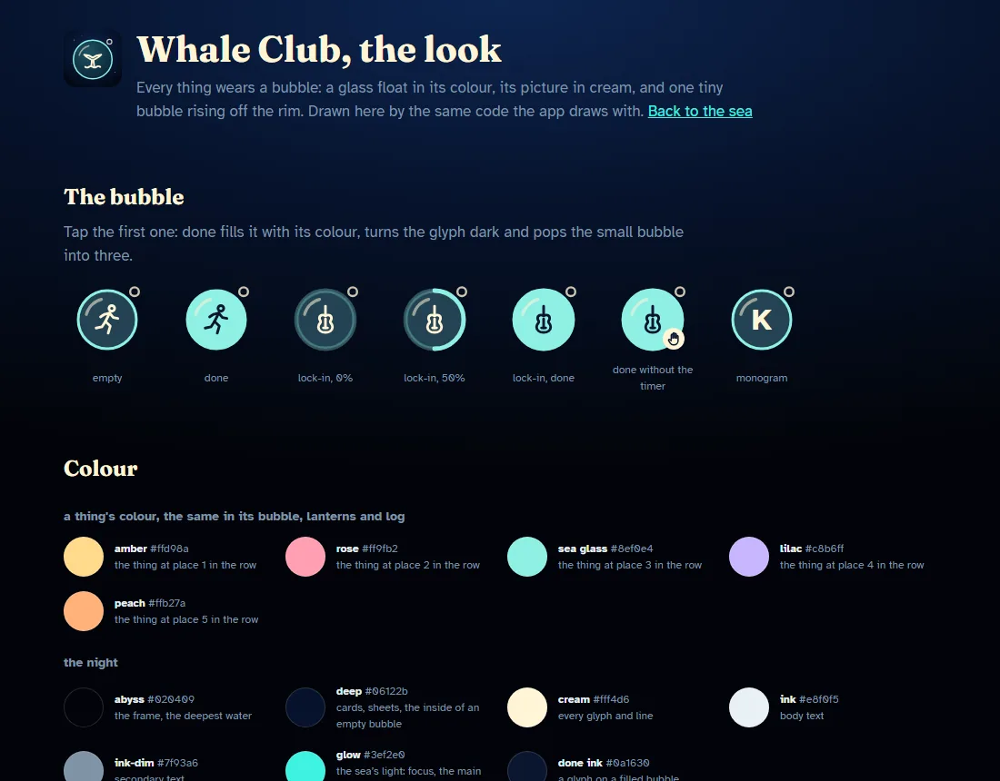
  &nbsp;
  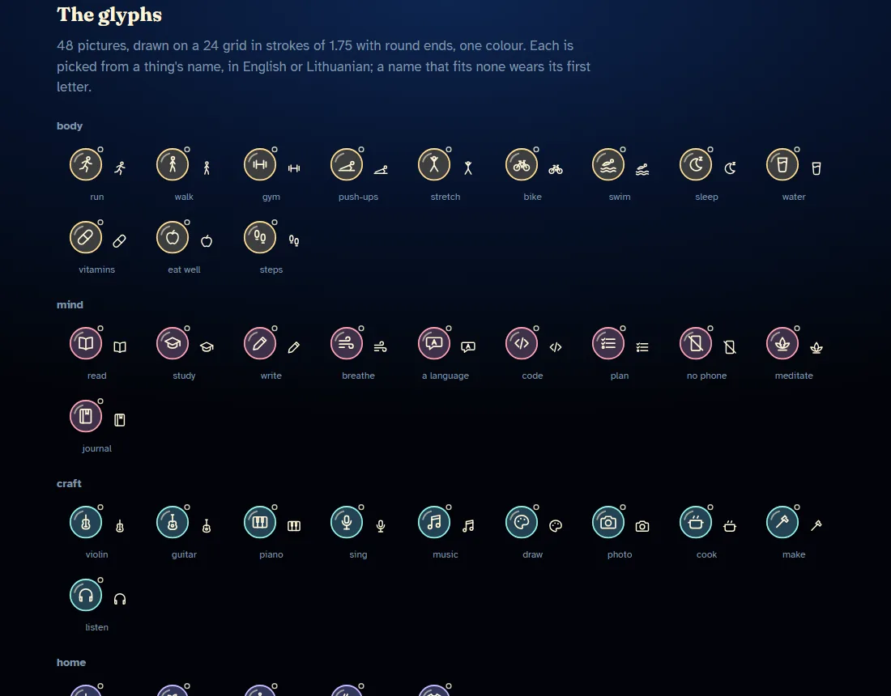
</p>

## Your data

Everything lives in `localStorage` on the device, as one versioned JSON
object. Nothing is sent anywhere: there is no backend, no analytics and no
third-party script. A postcard is the only thing that leaves the phone, and
only through the share sheet when you send it.

- **Derived, not stored.** Finds, streaks and stars are worked out from the days themselves, so they can never disagree with the history
- **Migrations.** Every earlier version of the data opens in the current app, held by tests. A record that cannot be read is parked beside the real one, never written over
- **A lab.** A hidden sandbox with a movable clock, for trying a year in a minute, under its own storage key so it never touches real data ([the lab](docs/ARCHITECTURE.md#10-the-lab))

## Under the hood

Vite and TypeScript in strict mode (with `exactOptionalPropertyTypes` and
`noUncheckedIndexedAccess`), vanilla DOM, no UI framework: the app is one
screen and a few sheets, and a framework would be most of the bundle for
none of the work. The creatures, finds and icons are SVG drawn in code; the
stars, the particles and the lanterns are three small canvases. Every
animation moves only `transform` and `opacity`, all of it runs on one
ticker that stops when the page is hidden, and reduced motion keeps the
fades and drops the movement. The intro's score is synthesised with the
Web Audio API.

| Folder                         | What is in it                                                                                                      |
| ------------------------------ | ------------------------------------------------------------------------------------------------------------------ |
| [`src/store`](src/store)       | The data model, the one store that touches `localStorage`, migrations, dates, and everything derived from the days |
| [`src/scene`](src/scene)       | The night scene: sky, sea, shore, stars, creatures, finds, lanterns, particles, the ticker                         |
| [`src/app`](src/app)           | The interface: cards, sheets, the lock-in, the intro, postcards, sound                                             |
| [`src/brand`](src/brand)       | The bubble, the 48 glyphs and the name matcher, the icons, and the page that shows them                            |
| [`src/styles`](src/styles)     | Tokens first (colour, type, space, motion curves and durations), then one file per surface                         |
| [`src/voice.ts`](src/voice.ts) | Every line the app says, by moment                                                                                 |

The map of the whole thing, and how to add a world or a find, is
[`docs/ARCHITECTURE.md`](docs/ARCHITECTURE.md).

## How it is checked

Nothing ships on a feeling. A push to `main` deploys only when lint, the
type check, the build and every test pass.

| What              | How                                                                                                                                                                                                                                                         |
| ----------------- | ----------------------------------------------------------------------------------------------------------------------------------------------------------------------------------------------------------------------------------------------------------- |
| **Browser tests** | 110+ Playwright scenarios against the production build, each run on an iPhone 13, a Pixel 5 and a 1366x768 desktop: the first minute, a lock-in left and resumed, a phone with no network, a phone that died mid-session, a deploy taking over an open page |
| **Frame timing**  | A year of lanterns measured alone, after the device runs, so it is not sharing the machine                                                                                                                                                                  |
| **Lighthouse**    | Mobile 98 performance, 100 accessibility, 100 best practices, 100 SEO; desktop 100 across the board (v0.8.0, median of three runs)                                                                                                                          |
| **Accessibility** | Audited against the Web Interface Guidelines: names on every control, focus kept and returned by every sheet and the session screen, a live region for what changes, 44 px targets, reduced motion                                                          |
| **Motion**        | Reviewed against a written standard for curves, durations, interruptibility and origin, with what changed in [`docs/QUALITY.md`](docs/QUALITY.md)                                                                                                           |
| **Data**          | Data from every earlier version migrates, and malformed parts are dropped one by one without losing a day                                                                                                                                                   |
| **Code**          | ESLint and Prettier on everything; the clock is read in one file only, enforced by a lint rule                                                                                                                                                              |

## Run locally

```bash
npm install
npm run dev        # dev server
npm run build      # type check, then the production build in dist/
npm run preview    # serves the build the way GitHub Pages does
npm test           # Playwright on three devices (npx playwright install chromium, once)
npm run lint       # ESLint and Prettier
npm run shots      # the README's pictures, from a seeded history under a pinned clock
```

Requires Node 22 or newer. Deploying is a push to `main`:
[`.github/workflows/deploy.yml`](.github/workflows/deploy.yml) lints,
builds, tests and publishes `dist/` to GitHub Pages. Pull requests get the
build and the tests, and never deploy.

## Docs

- [`docs/STATE.md`](docs/STATE.md): where the project is, and what comes next
- [`CHANGELOG.md`](CHANGELOG.md): how it got here, version by version
- [`docs/ARCHITECTURE.md`](docs/ARCHITECTURE.md): where the code is, how data flows, how to add to it
- [`docs/DECISIONS.md`](docs/DECISIONS.md): the harder calls, and what each one costs
- [`docs/DESIGN.md`](docs/DESIGN.md): colours, type, layout, the signature moment
- [`docs/brand/BRAND.md`](docs/brand/BRAND.md): the bubble, the glyphs, the app icon
- [`docs/QUALITY.md`](docs/QUALITY.md): the motion and interface audits, with what changed
- [`docs/COLLECTIBLES.md`](docs/COLLECTIBLES.md): every find, by world, line and day
- [`docs/RESEARCH-DOPAMINE.md`](docs/RESEARCH-DOPAMINE.md) and [`docs/RESEARCH-SEA.md`](docs/RESEARCH-SEA.md): the research behind the reward design and the daily surprise

## License

**[MIT](LICENSE)**.

In one sentence: take it, change it, ship it. Keep the copyright line and
the license text with any copy you pass on, and take it as it is: there is
no warranty of any kind. The screenshots are covered too; every one is of a
seeded sample history, so there is nothing personal in them.
