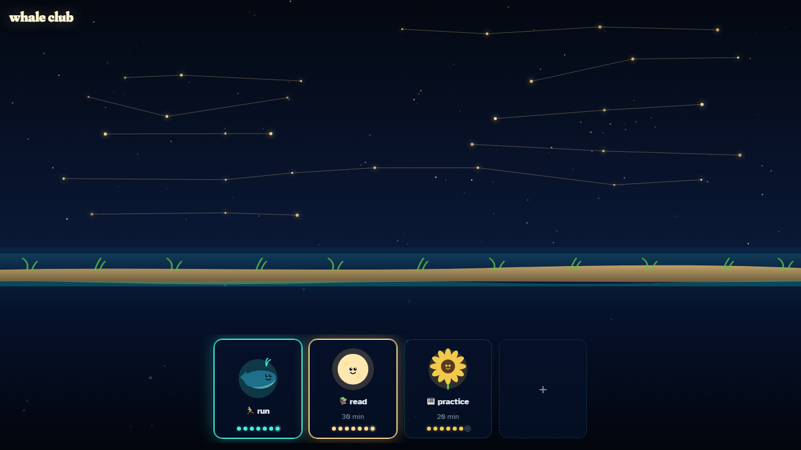

# Whale Club

A habit game where nothing dies.

Pick a few simple things. Tap them when done, or run a timer. Every day you
show up, the scene fills: a star in the sky, a creature that grows, a
collectible unlocked. Miss a day and the sea goes quiet for a day. That is
all that happens.

**Live:** https://dovjonikas.github.io/whale-club/ (placeholder until Pages
is enabled)

<p align="center">
  
  &nbsp;&nbsp;
  
</p>

<p align="center">
  
</p>

## The rules

1. the first rule of whale club is: you show up.
2. the second rule of whale club is: you show up tomorrow.
3. the third rule: nothing dies. you just missed a day.

## Features

- **One screen.** Night sky above, sea below, a shore with a garden at the
  horizon. The row of your things at the bottom. Nothing else.
- **Up to five things**, each assigned a world in turn: sea, sky, garden,
  sea, sky. You do not pick; every scene gets all three layers.
- **Tap = done today.** The creature jumps, the world answers (bubbles,
  star dust, petals), one short line. Tap again to undo.
- **Hold = timer.** 15, 30, 60 minutes or your own. The creature swims
  while it runs, the screen goes calm, and finishing counts.
- **Creatures grow** with the last seven days, not with your lifetime
  total, so they can shrink and grow back. Nothing is ever lost.
- **Stars are days.** Every day with at least one thing done puts a star
  in the sky, laid out week by week. A streak draws a constellation. After
  a few months the sky is the progress report, no graph needed.
- **A missed day** dims the scene for a day and says so. That is the whole
  punishment.
- **Installable.** Works offline from the home screen on iPhone and
  Android, updates itself, no account, no server, no tracking. Everything
  stays in your browser.

Coming in the next stages: collectibles unlocked by total days (with the
locked ones shown as silhouettes), the whale surfacing when everything is
done, a daily surprise, a silly daily check-in, a weekly recap, sound, a
share image, and a buddy slot.

## Tech

Vite, TypeScript (strict, no `any`), vanilla DOM, SVG creatures, two small
canvases (stars, particles) animated with transforms and opacity only.
localStorage for data. `vite-plugin-pwa` for the manifest and the
service worker. Playwright for tests on three device profiles. GitHub
Actions to GitHub Pages.

## Run

```bash
npm install
npm run dev
```

Then open the URL Vite prints. `npm run build` builds into `dist/`,
`npm run preview` serves the build the way Pages does.

## Test

```bash
npx playwright install chromium
npm test
```

Runs every test on an iPhone 13, a Pixel 5 and a 1366x768 desktop against
the production build. `npm run lint` runs ESLint and Prettier.

## Deploy

Push to `main`. The workflow in `.github/workflows/deploy.yml` lints,
builds, runs the tests, and publishes `dist/` to GitHub Pages. Pull
requests get the build and the tests but never deploy.

## Docs

- [docs/DESIGN.md](docs/DESIGN.md): colours, type, layout, the signature moment.
- [docs/COLLECTIBLES.md](docs/COLLECTIBLES.md): every collectible, by world, line and day.
- [docs/ARCHITECTURE.md](docs/ARCHITECTURE.md): how it is put together and how to add to it.
- [docs/DECISIONS.md](docs/DECISIONS.md): what was decided and why.
- [docs/STATE.md](docs/STATE.md): where the project is.
- [docs/RESEARCH-SEA.md](docs/RESEARCH-SEA.md) and [docs/RESEARCH-DOPAMINE.md](docs/RESEARCH-DOPAMINE.md): the research behind the daily surprise and the reward design.

## License

MIT. See [LICENSE](LICENSE).

Built with Claude Code; the idea, the rules, the design direction, the
testing and the decisions are the author's.
