# The interface audit, before and after

Whale Club 1.3.0 began with a professional pass: every surface of the app in
every state (54 of them, listed in [SURFACES.md](SURFACES.md)), pictured at a
390 × 844 phone and a 320 × 568 one, checked against one list, fixed, and
pictured again. The findings, each with its file and line, what was wrong
and why it mattered, are in [docs/QUALITY.md](../QUALITY.md) ("The
professional pass"). A new test, `tests/e2e/layout.e2e.ts`, now keeps the two
rules that can be measured: every control is 44 px to the finger, and nothing
goes past the edge of the smallest phone.

The pictures come from `scripts/audit.mjs`: `before/` from the v1.2.4 build,
`after/` from this one, same data, same clock. These are the ten pairs that
changed most.

## 1. The line for the day

The author's first note: the card was too tall, and "ok" and "send this"
were far from the words. Every card above the row is now one component: the
words, then one row with a quiet note on the left (here, who said it) and the
actions on the right, the last one a pill.

| Before                                                     | After                                                     |
| ---------------------------------------------------------- | --------------------------------------------------------- |
| 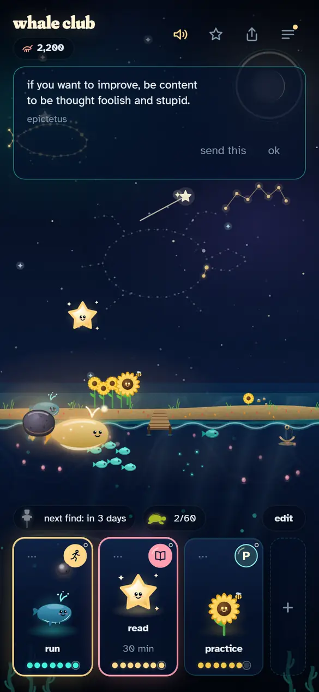 | 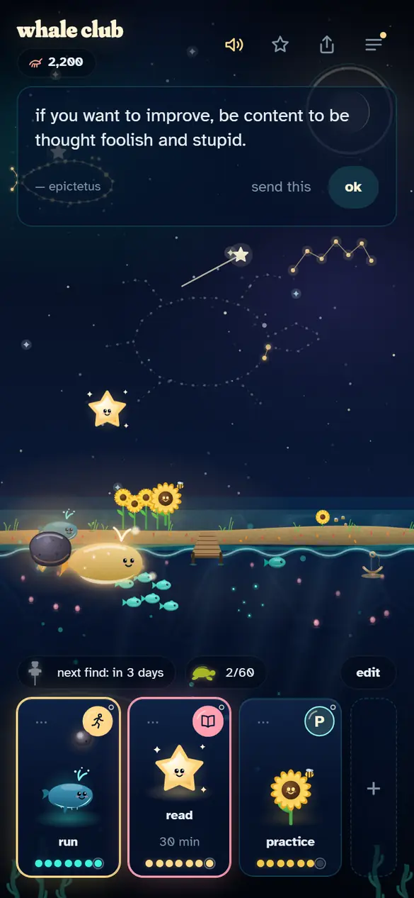 |

## 2. One good thing today

The card the bottles come from, the author's second note. "tomorrow: …"
moved into the footer, beside the buttons.

| Before                                                       | After                                                       |
| ------------------------------------------------------------ | ----------------------------------------------------------- |
| 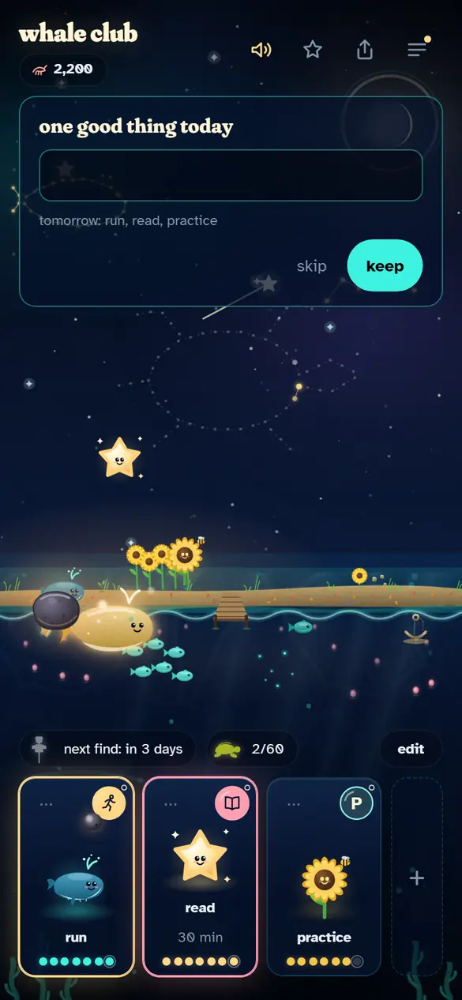 | 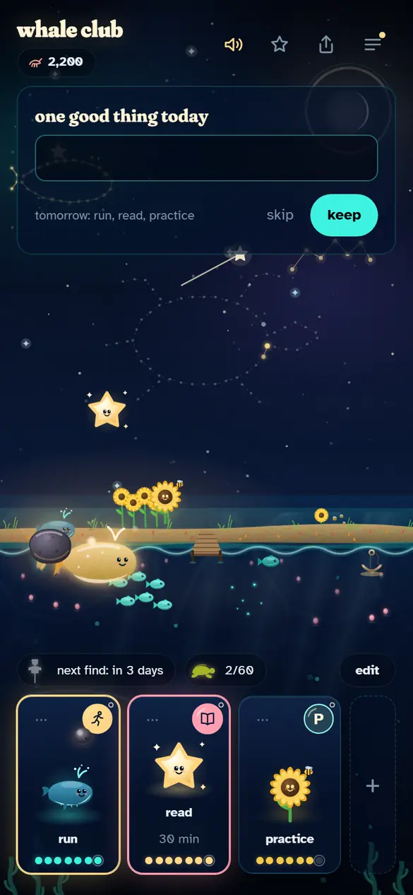 |

## 3. The club

"Buttons, and then random text." The rules were the loudest type on the
screen. Now: which day of the club under the title, the way in, a small mark
over the rules at reading size, numbered, and the club's line last, after a
hairline, like a signature.

| Before                                                 | After                                                 |
| ------------------------------------------------------ | ----------------------------------------------------- |
| 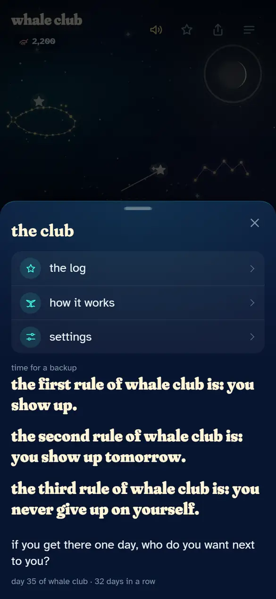 | 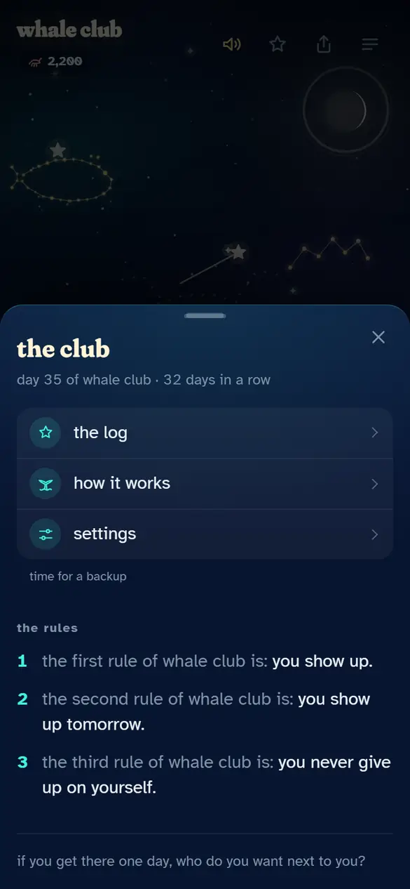 |

## 4. The check-in

The one card with a stacked column of buttons. Now it has the order every
card has: quiet words first, the one bright answer at the edge.

| Before                                                          | After                                                          |
| --------------------------------------------------------------- | -------------------------------------------------------------- |
| 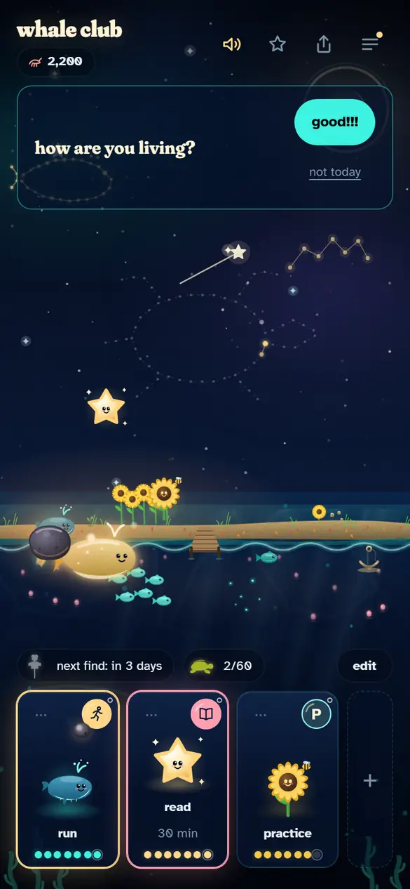 | 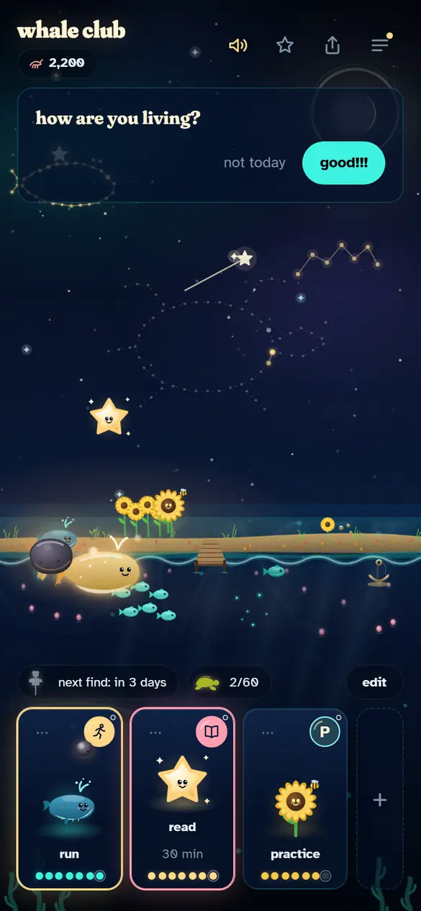 |

## 5. The install card at 320 px

Two columns at 320 px: the title broke in two, the lead in three, and "not
now" floated under the button.

| Before                                                         | After                                                         |
| -------------------------------------------------------------- | ------------------------------------------------------------- |
| 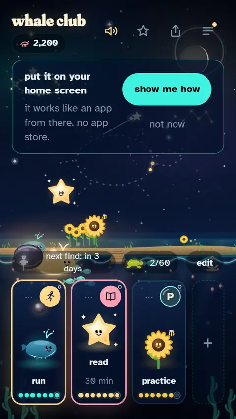 | 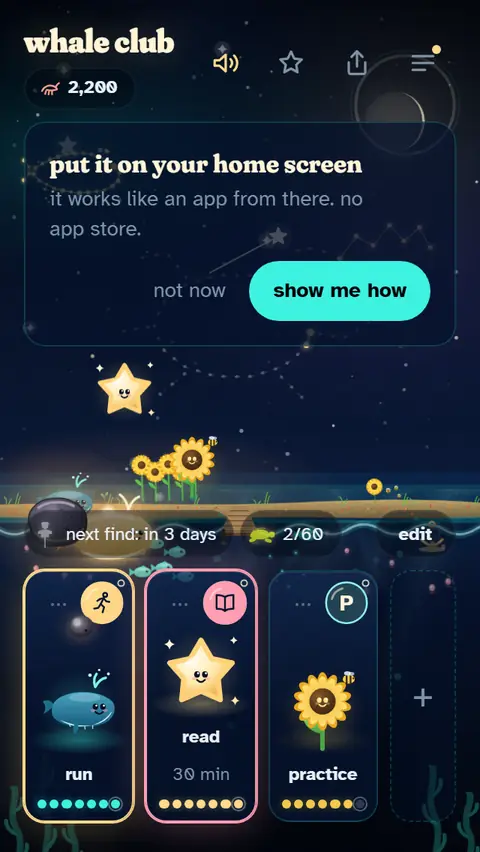 |

## 6. The week's recap

Two quiet words floating under a number; now the same card as the others,
ending on "ok".

| Before                                                  | After                                                  |
| ------------------------------------------------------- | ------------------------------------------------------ |
| 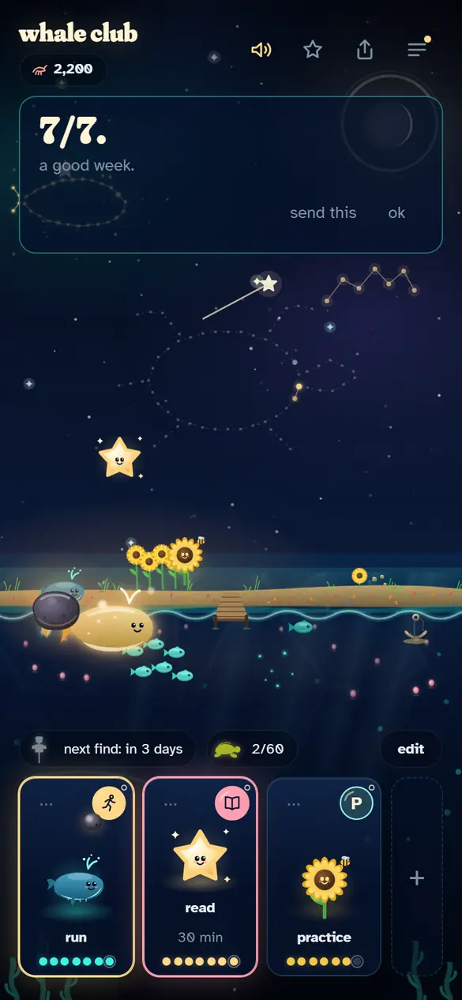 | 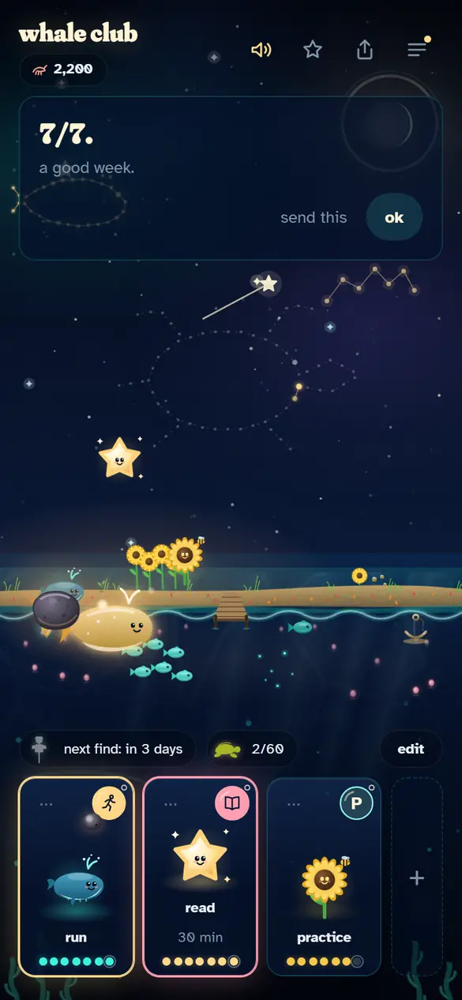 |

## 7. The log at 320 px

Seven square days of 44 px need 332 px; a 320 px phone has 288. Sunday was
past the edge and the sheet scrolled sideways. The days now narrow and keep
their height.

| Before                                                      | After                                                      |
| ----------------------------------------------------------- | ---------------------------------------------------------- |
| 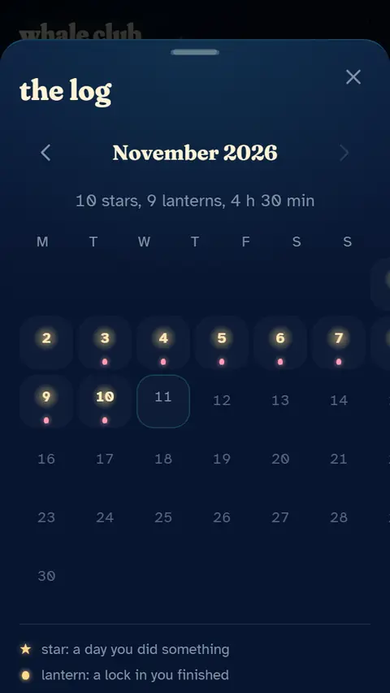 | 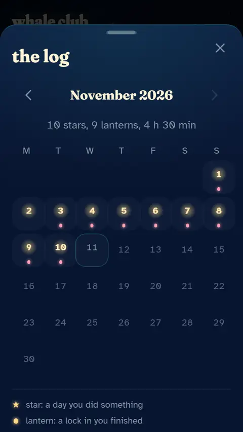 |

## 8. A soft day at 320 px

The bottle lay under the line's glass, and "next find: in 3 days" broke out
of its pill. The bottle now keeps above the bottom block on a short phone,
and the goals fit on one line.

| Before                                                     | After                                                     |
| ---------------------------------------------------------- | --------------------------------------------------------- |
| 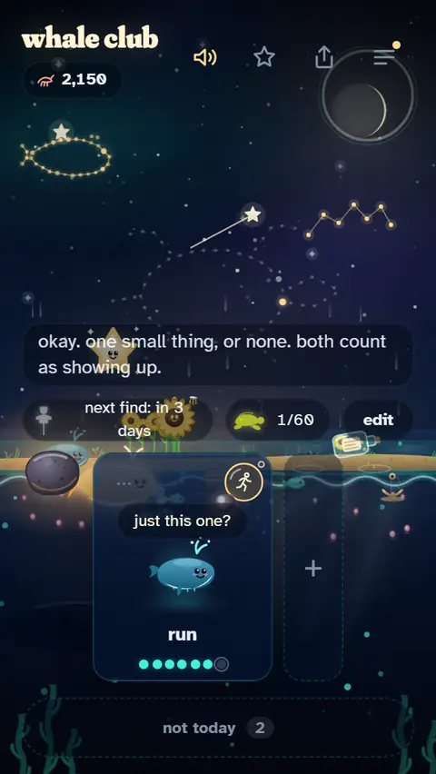 | 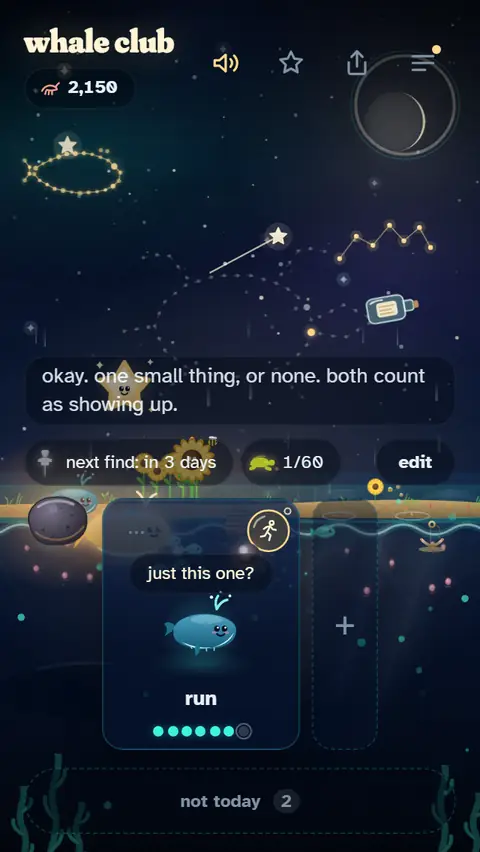 |

## 9. A bottle

Words written weeks ago sat in a box that looked like a field to type in.
Now they are a quote.

| Before                                                   | After                                                   |
| -------------------------------------------------------- | ------------------------------------------------------- |
| 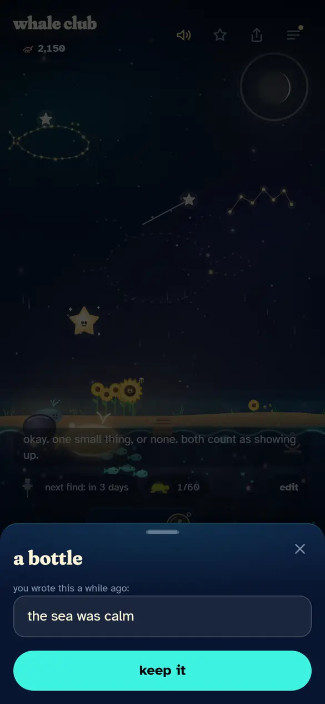 | 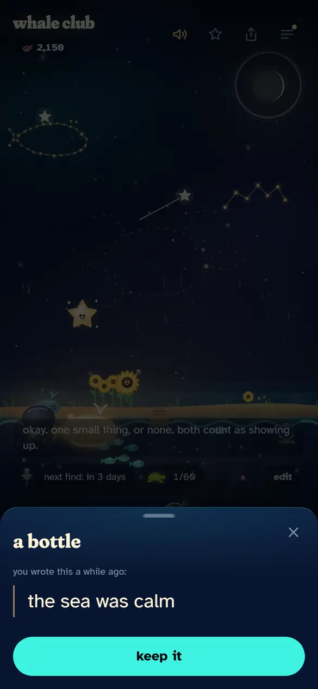 |

## 10. How it works

The same heavy rules, and a bright 48 px button in the middle of a page for
reading. Now the rules block of the club, and the intro as a row.

| Before                                                         | After                                                         |
| -------------------------------------------------------------- | ------------------------------------------------------------- |
| 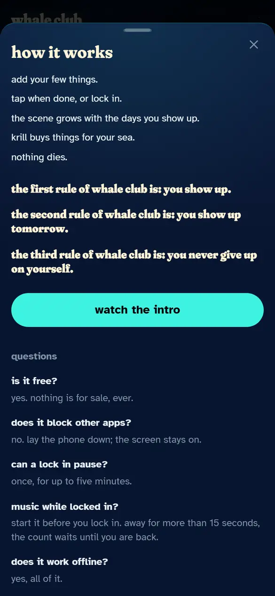 | 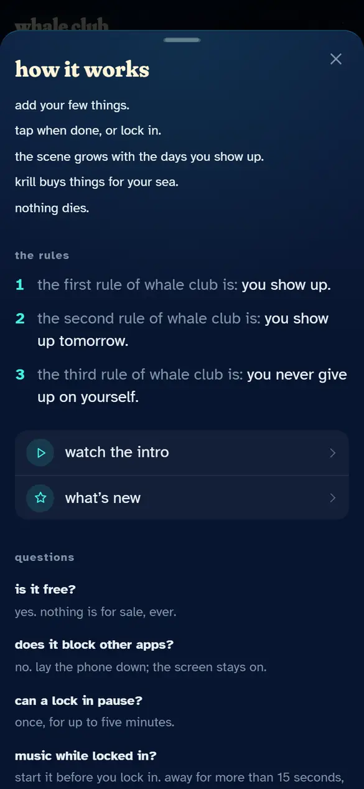 |

## Run it again

```
npm run build && npm run preview
node scripts/audit.mjs after            # every surface, both sizes
node scripts/audit.mjs after 12-day     # only the surfaces whose name contains it
```

`AUDIT_BASE` points the script at another build, as the `before` set was
taken from v1.2.4 served on its own port.
